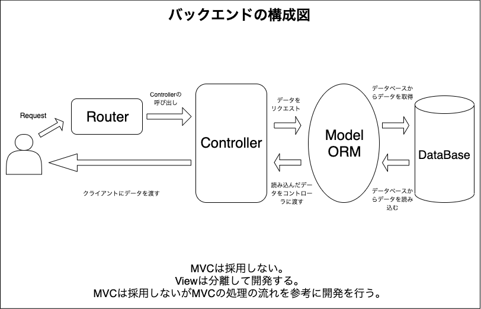
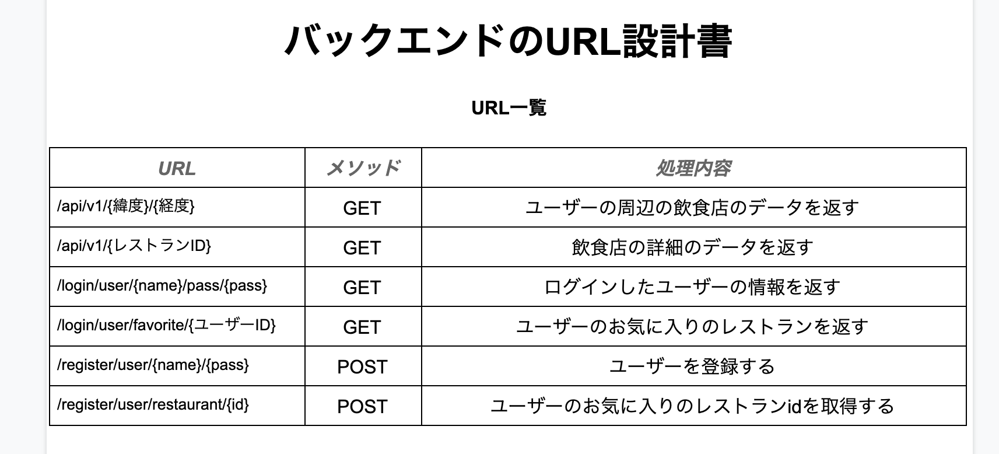
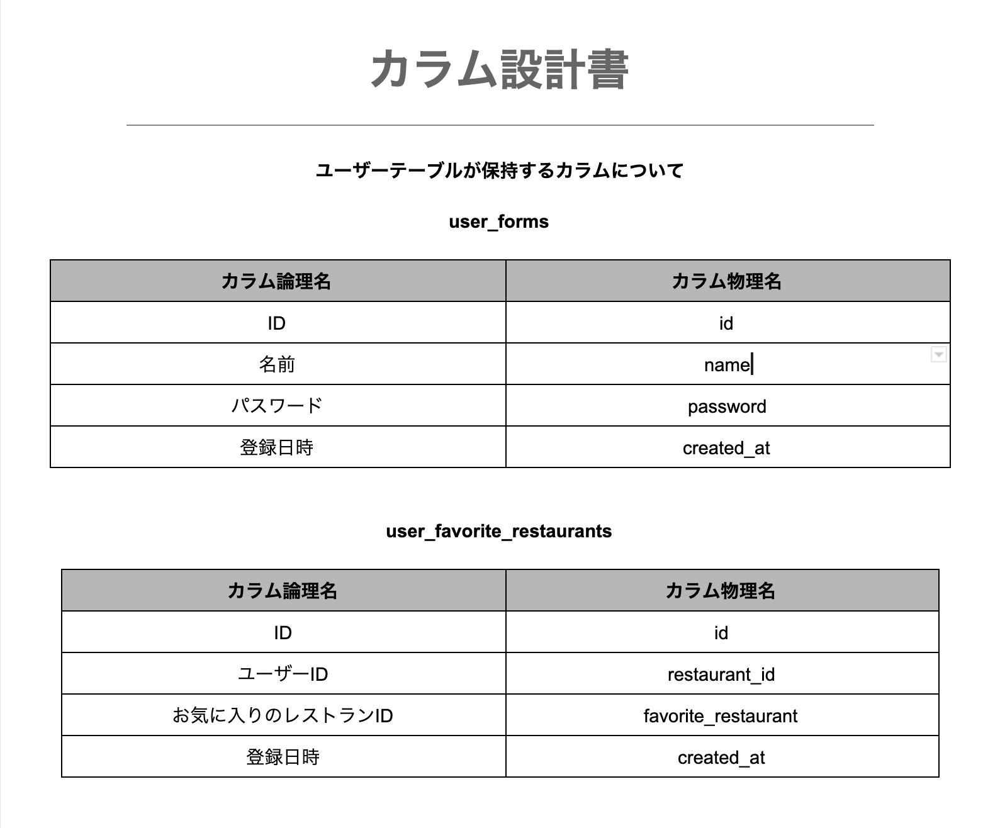

<h1 align="center">RestaurantSearcher-Backend</h1>

  
  
  
  
  

 

## 開発環境

- OS: **macOS Catalina**

- TextEditor: **VisualStudioCode**

- PHP: **7.3.9**

- Laravel: **7.25.0**

- Composer: **1.10.10**

 

## Laravelを選択した理由

Laravelに興味があり、実践してみたいと考え、Laravelを選択しました。

Laravelは2015年あたりから勢いをましているPHPのフレームワークで2020年のGoogle trendsではSymphonyが一番検索されており、Laravelの検索は少し減りましたが、それでもなお日本では人気のフレームワークです。

このような理由から私もLaravelを利用してみたいと思い、今回のプロジェクトのバックエンドのフレームワークとして利用しました。

また、日本の求人にはPHPに関しての求人が多かったので、PHPを触れるいい機会でした。

 

<h2 align="center">機能用件</h2>

- ユーザーの現在地をパラメーターで受け取り、ぐるなびAPIにリクエストを送る

- 取得したぐるなびAPIのデータをフロントでの利用性を向上させるデータに変換し、レスポンスとしてJSON形式のデータを返す

- ユーザーの選択した飲食店のIDをパラメーターから取得し、選択された飲食店のデータをフロントで扱いやすい形に整形して、JSON形式にレスポンスを返す。

- パラメーターからユーザーネームとパスワードをパラメーター取得し、DB上に取得したユーザーネームとパスワードと一致するデータをJSON形式にレスポンスする。

- ログインユーザーのユーザーIDをパラメーターから取得して、同ユーザーがお気に入り登録している飲食店のIDをJSONレスポンスとして返す。

 

<h2 align="center">非機能用件</h2>

- カスタマイズ性の高いプロジェクトを作成する

- 可読性の高いコードを記述する

- メンテナンス性の高いプロジェクトを作成

- 可用性を向上し、障害が発生した場合でもすぐに復旧できるプロジェクトを作成

- 他のユーザーの情報を取得しない

- 不可に耐久できる

 

## Laravelを利用した感想

パワフルなフレームワークという印象でした。

今回はフロントとバックエンドを分離した開発を行いたっかたので、分離しましたが私がLaravelを利用して感じたのは分離をするのではなくLaravel単体でプロジェクトを作成したほうが良かったかもしれないという感想でした。

Laravelはパワフルなフレームワークなので簡単に開発をすることができますが、サービスの分離に関しては他の自由度の高いフレームワークを利用した方が良いと思いました。

認証に関して自身で作成する場合はわからないことがあり検索を行ってもLaravel標準の Auth に関する情報しか出てきませんでした。

このように少し不満もありますが、とても利便性の良いフレームワークでした。今後も利用したいと思いました。

 

## 当プロジェクトの簡易図

これが当プロジェクトのバックエンドの簡易構成図です。

この構成図には**MVC**の**V**にあたる部分が存在していません。

なぜならフロントは分離しているからです。ですので、当プロジェクトのバックエンドは**APIサーバー**, **DBサーバー**として利用をしています。

これが当プロジェクトの簡易設計図です。

 

## URL設計

バックエンド側のURLの設計図

 

## テーブル設計

**user_forms**と**user_favorite_restaurants**により構成されている

 

## カラム設計

カラムの設計図

テーブルの保持するカラムについての記述を行う。